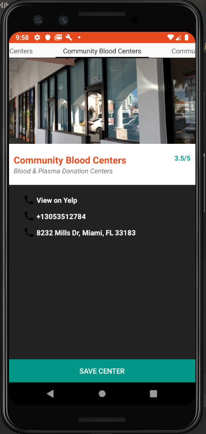
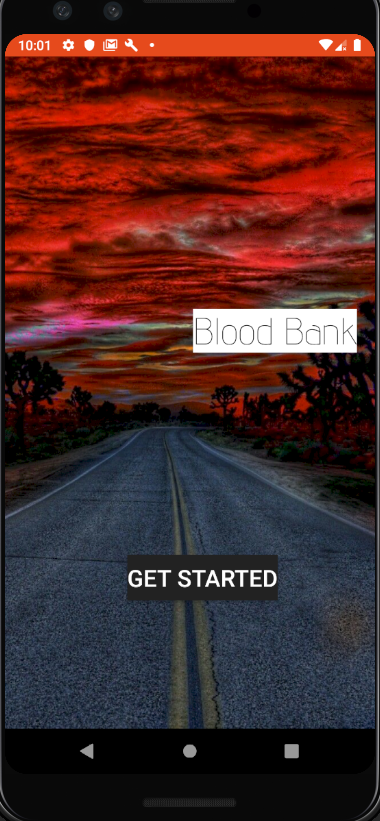
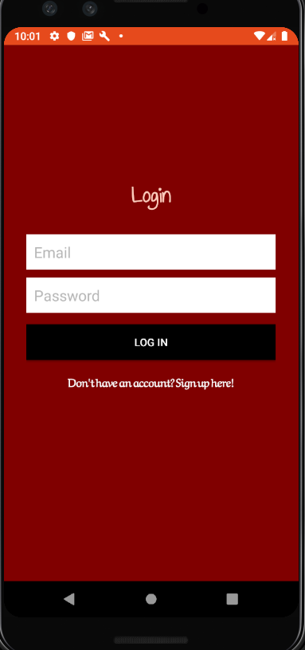
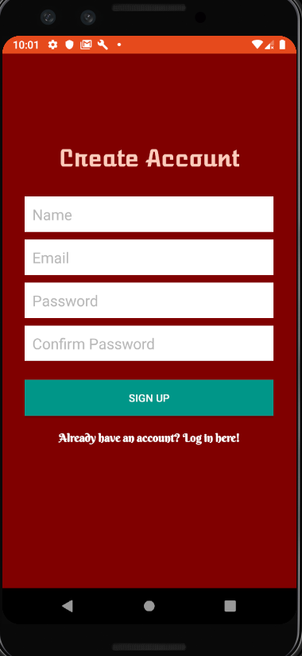
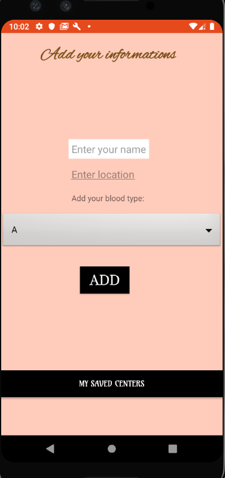
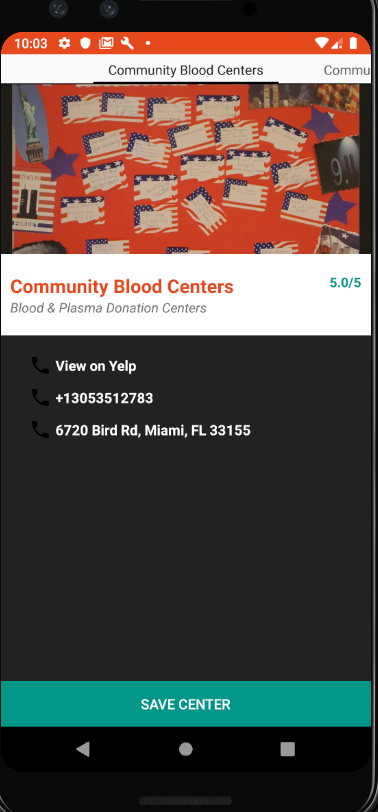

# Blood bank
#### Online blood provider,14th October 2019
#### By **Esther Carrelle**
## Description
An Online android app for blood givers and blood searchers
## Setup/Installation Requirements
* Go to GitHub account => www.github.com/esthcarelle
* Go to my repositories.
* Select blood_bank.
* Click on the green button labeled: clone or download. you can clone or download it directly into your computer.
* Unzip the folder.
* You should have all the project files.

##  Screenshot

## BDD
* The user will signup for an account.
* The user will be able to login using his/her credentials.
* Once logged in, the user will enter the blood type he wants to be given and willl search for avalaible givers.
* A giver will also be able to enter his informations.
## Known Bugs
There no bugs in the application.
## Technologies Used
* Java
*  Android
## Support and contact details
If you run into errors, please feel free to contact us on github.
### License
Copyright (c) 2019 **Esther Carrelle**